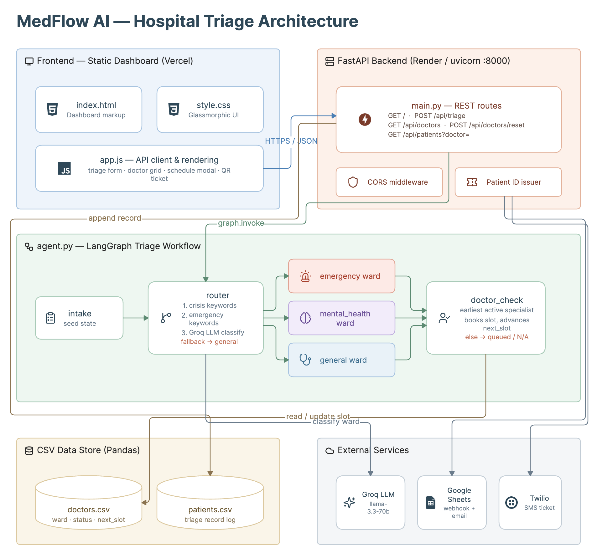
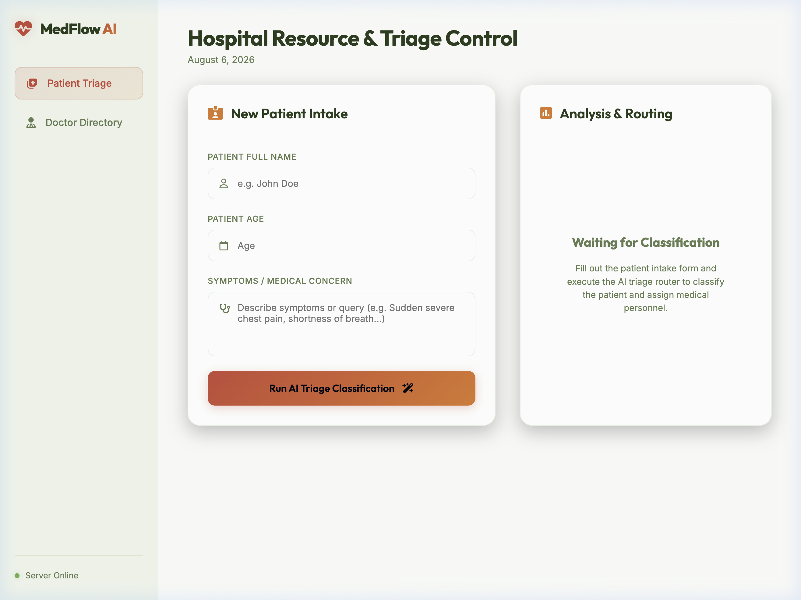
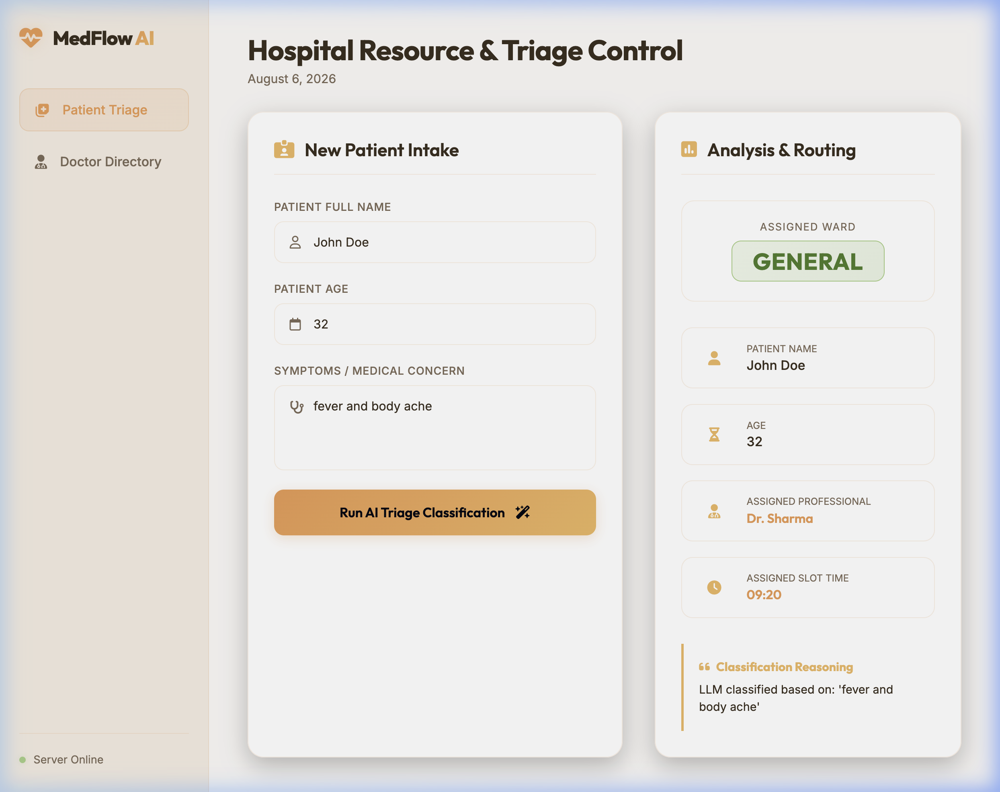
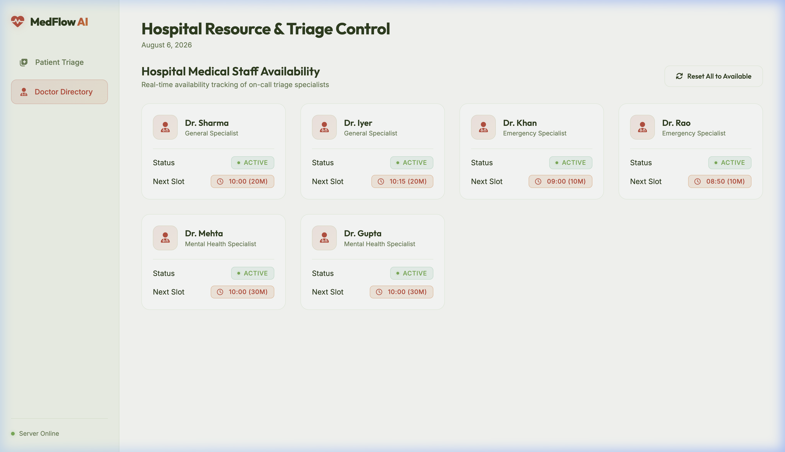
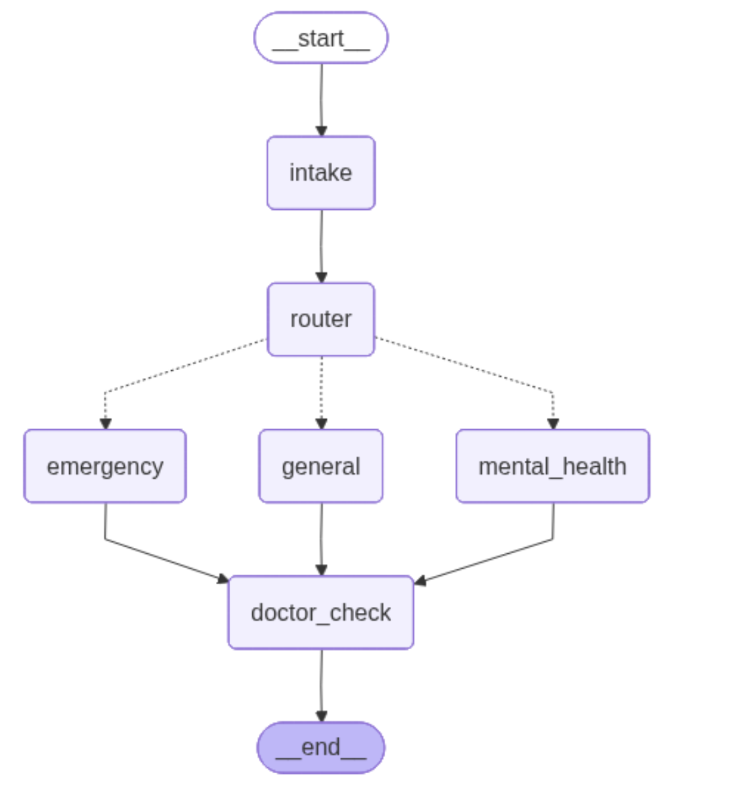

# MedFlow AI - Hospital Triage Dashboard

MedFlow AI is an intelligent hospital triage and appointment allocation system. It evaluates patient symptoms, routes each case to a suitable care ward, assigns an available specialist, and records the patient schedule for the assigned doctor.

The current implementation is split into a FastAPI backend powered by a LangGraph workflow and a vanilla HTML, CSS, and JavaScript dashboard interface with responsive glassmorphic UI styling.

🚀 Live Demo: https://hospital-agent-topaz.vercel.app/

## System Architecture

The following diagram represents the high-level MedFlow AI architecture:



## UI Showcase

Screenshots of the current MedFlow AI experience:









---

## What This Project Does

MedFlow AI supports a hospital intake flow that:

- Accepts patient name, age, contact details, and symptom query
- Routes the request to one of three care pathways:
  - `emergency`
  - `mental_health`
  - `general`
- Applies safety override rules before LLM classification
- Finds the next available active doctor for the selected ward
- Updates next slot availability in `doctors.csv`
- Logs the new triage patient record into `patients.csv`
- Sends optional downstream updates to Google Sheets and Twilio SMS endpoints when credentials are configured

---

## Project Structure

```text
/Hospital-agent
├── backend/
│   ├── .env                 # Optional environment settings for Groq, Google Sheets, and Twilio
│   ├── agent.py             # LangGraph workflow and routing intelligence
│   ├── doctors.csv          # Current ward doctor availability and slot data
│   ├── main.py              # FastAPI API server and route handlers
│   ├── patients.csv         # Patient triage registration log
│   └── requirements.txt     # Python dependencies
└── frontend/
    ├── index.html            # Dashboard markup
    ├── style.css             # Responsive styling and visual polish
    └── app.js                # API client layer and UI rendering logic
```

---

## Backend Setup

### 1. Create a Python environment

From the repository root:

```bash
cd backend
python3 -m venv venv
source venv/bin/activate
```

### 2. Install dependencies

```bash
pip install -r requirements.txt
```

### 3. Configure environment variables

Create a `.env` file in the backend directory if it does not already exist.

Example:

```env
GROQ_API_KEY=gsk_your_groq_api_key_goes_here
GOOGLE_SHEET_WEBHOOK_URL=https://example.com/webhook
TWILIO_ACCOUNT_SID=your_account_sid
TWILIO_AUTH_TOKEN=your_auth_token
TWILIO_FROM_NUMBER=+1234567890
```

The Groq API key is required for normal LLM-based ward classification. If it is not configured or the external model request fails, the router falls back safely to the general ward and returns the exception explanation in the reasoning field.

### 4. Run the API server

```bash
uvicorn main:app --host 127.0.0.1 --port 8000 --reload
```

The API will be available at:

http://127.0.0.1:8000

---

## Frontend Setup

The frontend is a static web dashboard.

You can either:

1. Open `frontend/index.html` directly in a browser, or
2. Serve it locally using a static file server such as `npx serve` or VS Code Live Server.

The current frontend client is configured to call:

- `http://127.0.0.1:8000` when running locally or opened directly from the file system
- A deployed Render backend URL for production/browser-hosted use

---

## API Reference

### `GET /`
Returns a small health/welcome response for the API backend.

### `POST /api/triage`
Triage a patient and assign a doctor schedule slot.

Request body:

```json
{
  "name": "Jane Smith",
  "age": "28",
  "email": "jane@example.com",
  "mobile": "+1234567890",
  "query": "Sudden severe chest pain and difficulty breathing."
}
```

Successful response shape:

```json
{
  "name": "Jane Smith",
  "age": "28",
  "query": "Sudden severe chest pain and difficulty breathing.",
  "ward": "emergency",
  "reasoning": "Emergency keyword detected — routed immediately for safety.",
  "assigned_doctor": "Dr. Rao",
  "assigned_slot": "08:50",
  "patient_id": "PID-2026-ABC12",
  "mobile": "+1234567890",
  "email": "jane@example.com"
}
```

### `GET /api/doctors`
Returns the complete doctor roster from `doctors.csv`.

### `POST /api/doctors/reset`
Resets doctor schedules to the default active state and clears the patient schedule log.

### `GET /api/patients`
Returns stored patient records from `patients.csv`. You can optionally filter by matching doctor using `?doctor=<name>`.

---

## Routing Logic

MedFlow AI uses a LangGraph state machine built in `agent.py`:

1. `intake` receives the patient payload
2. `router` decides the ward using:
   - emergency keyword safety overrides
   - crisis keyword safety overrides
   - LLM classification when no emergency/crisis override applies
3. The correct ward branch writes a result explanation
4. `doctor_check` selects the earliest active specialist in the selected ward
5. The ward and assigned doctor slot are returned to the client

The router includes safe fallback behavior.

---

## Safety & Fallback Behavior

The current implementation includes several safety checks:

- Crisis indicators such as `suicide`, `self-harm`, and `want to die` route directly to the mental health branch.
- Emergency terms such as `chest pain` and `heart attack` route directly to the emergency branch.
- If the LLM service is unavailable, the system attempts to classify through a silent safe fallback to the general ward and records the error in reasoning.
- If no doctor is active in a ward, the result returns `No doctor currently free — patient will be queued` with an `N/A` slot.

---

## Optional Integrations

The backend is prepared for optional integrations that are disabled unless configured:

- Google Sheets webhook logging via `GOOGLE_SHEET_WEBHOOK_URL`
- Twilio SMS notifications via `TWILIO_ACCOUNT_SID`, `TWILIO_AUTH_TOKEN`, and `TWILIO_FROM_NUMBER`

---

## Technologies Used

- Python
- FastAPI
- LangGraph
- LangChain Groq integration
- Pandas
- Vanilla HTML, CSS, and JavaScript
- QR ticket generation in the frontend
